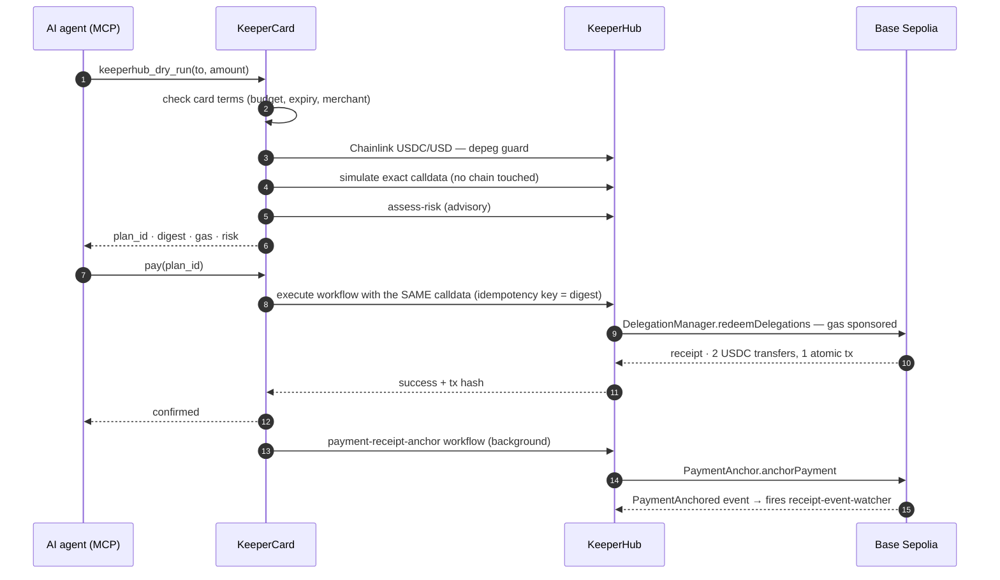

# KeeperCard

**Spending cards for AI agents. KeeperCard decides what an agent may spend; [KeeperHub](https://keeperhub.com) moves the money.**

[](https://keeperhub.com)
[](https://sepolia.basescan.org/address/0x56733223c688cce7fc65826b692b3f8521e4ab3e)
[](https://eips.ethereum.org/EIPS/eip-7710)
[](https://modelcontextprotocol.io)
[](https://www.x402.org)

Agents are probabilistic. Moving money is not forgiving. KeeperCard gives an agent a
card — a scoped, revocable ERC-7710 delegation from your own wallet — and hands every
transaction to KeeperHub: composed as a workflow, **dry-run without touching the chain,
reviewed, and then that exact plan executes.** Nothing is re-derived at execution time.

**Live:** [dashboard](https://keepercard-dashboard.adoranto737.workers.dev) ·
[execution console](https://keepercard-dashboard.adoranto737.workers.dev/keeperhub) ·
[API health](https://attestpay-api.onrender.com/health) — the API is on a free tier, so
the first request after idle takes ~50s to wake.

---

**Contents:** [The problem](#the-problem) · [How a payment works](#how-a-payment-works) ·
[The split](#the-split) · [KeeperHub usage](#how-much-of-keeperhub-this-uses) ·
[Workflows](#the-workflows) · [Proof](#proof) · [Guardrails](#guardrails) ·
[Agent tools](#what-an-agent-sees) · [Architecture](#architecture) ·
[Getting started](#getting-started) · [Security](#security-model) · [Limitations](#known-limitations)

---

## The problem

An AI agent that can pay for things is useful. An AI agent holding a private key is a
liability. Today a team that wants its agent to buy API credits, datasets or compute has
two options, and both are bad:

1. **Give the agent a funded wallet.** One prompt injection, one hallucinated address,
   one retry loop — and the whole balance is gone. There is no "limit", no "merchant
   allowlist", no "undo".
2. **Keep a human in the loop for every payment.** Safe, and it defeats the point of
   having an agent.

And even with a limit in place, *moving* the money is its own engineering problem:
nonces, gas estimation, stuck transactions, retries that must not double-pay, an audit
trail someone can actually check. Most agent-payment demos quietly hand-roll all of that.

**KeeperCard splits the problem in two and gives each half to the right owner.**

| Question | Owner | Mechanism |
|---|---|---|
| *What may this agent spend?* | **KeeperCard** | A card is an ERC-7710 delegation from your wallet: budget, period, expiry, merchant and sub-card rules, enforced **on-chain** by caveat enforcers. Funds never leave your wallet until a payment lands. Freeze, revoke or nuke at any time |
| *How does the money actually move?* | **KeeperHub** | Every payment is a KeeperHub workflow: simulated first, then executed with managed nonces, gas sponsorship, retries, Turnkey signing, and a run history KeeperHub keeps — not us |

The result: an agent can pay on its own, can never exceed its card, and every payment
leaves three independent records — KeeperCard's ledger, KeeperHub's run history, and an
on-chain receipt.

---

## How a payment works



1. **Dry run.** The agent asks to pay. KeeperCard checks the card's terms, builds the
   exact redemption calldata, and has KeeperHub simulate it from the wallet that will
   execute it. Nothing touches the chain. The agent gets a `plan_id`, a digest of the
   calldata, a gas estimate and KeeperHub's risk read.
2. **Pay.** The agent calls `pay(plan_id)`. KeeperCard refuses any digest that was not
   dry-run within the plan's TTL, then hands the *same bytes* to a KeeperHub workflow.
   The idempotency key is derived from the digest, so a retried send can only replay.
3. **Execution.** KeeperHub manages the nonce, sponsors the gas, signs with its Turnkey
   wallet and redeems the delegation. The DelegationManager enforces the card's caveats
   on-chain; the merchant payment and the fee leg land in one atomic transaction.
4. **Receipt.** In the background, a second KeeperHub workflow writes a `PaymentAnchored`
   record on the same chain. That event fires a third workflow — started by the chain,
   not by KeeperCard — that reads the receipts back.

A failing or slow receipt can never delay, fail or roll back the payment it describes.

---

## The split

| | Owns |
|---|---|
| **KeeperCard** | *What may be spent* — caveats, budgets, sub-cards, freeze / revoke / nuke, the MCP surface an agent plugs into |
| **KeeperHub** | *Moving it* — dry runs, nonce management, gas estimation and sponsorship, retries, Turnkey signing, workflow history, chain reads, price feeds, risk |

Before this integration KeeperCard moved money with its own machinery: a relayer call, an
interval reconcile sweep, a settlement timer and a background worker. That is bespoke
infrastructure for a problem someone else has already solved properly.

```
your wallet (EIP-7702 smart account)
   └─ card  ($25/week, expires Oct 17)            ← root delegation, signed by you
       ├─ agent A plugs it in over MCP
       └─ sub-card ($1/week, one merchant)        ← redelegation, narrower terms
           └─ sub-agent B plugs it in

agent ── keeperhub_dry_run ──▶ KeeperCard checks the card's terms
                               KeeperHub simulates the exact calldata   (no chain touched)
      ◀── plan_id, gas, risk ──
agent ── pay(plan_id) ───────▶ KeeperHub workflow redeems the delegation (one atomic tx)
                               KeeperHub writes the on-chain receipt    (PaymentAnchor)
                               KeeperHub's Event trigger sees the receipt and records it
```

---

## How much of KeeperHub this uses

Not a wrapper around one endpoint. Every row is wired into the product and was exercised
against the live API.

| KeeperHub surface | What KeeperCard does with it |
|---|---|
| **Workflows API** — create, update, list, execute, status, step logs, run history | Nine workflows defined as code and provisioned by name; the server resolves them **by name at boot**, so a deployment needs no per-workflow configuration |
| **Dry run** — `execute/contract-call` with `simulate: true` | Every payment is simulated from the wallet that will execute it. The calldata is hashed at dry-run time and the digest is carried into execution: the bytes that run are the bytes that were reviewed |
| **Manual trigger** | `card-payment-redemption`, `x402-settlement`, `fiat-settlement`, `guarded-card-payment`, `payment-receipt-anchor` |
| **Schedule trigger** | `treasury-monitor` (every 10 min), `market-guard` (hourly) |
| **Event trigger** | `receipt-event-watcher` fires on every `PaymentAnchored` event — the chain starts the run, not KeeperCard |
| **Block trigger** | `fee-income-watcher` samples collected fees every 900 blocks |
| **`Condition` node** | Gates the write in `guarded-card-payment`; trips low-gas and depeg alarms |
| **`web3/assess-risk`** | Read on every dry run, and enforced *inside* `guarded-card-payment` |
| **`web3/write-contract`** | `DelegationManager.redeemDelegations`, `PaymentAnchor.anchorPayment` |
| **`web3/query-events`** | Reads receipts back from the chain to reconcile against KeeperCard's own ledger |
| **`web3/check-balance`, `check-token-balance`** | Live gas and USDC of the wallets payments depend on |
| **`check-and-execute`** | A funding floor on the settlement sweep: the read and the guarded write in one request |
| **Protocol actions — Chainlink** | USDC/USD and ETH/USD reference feeds; the depeg guard |
| **Gas sponsorship** | Every transaction below was sponsored; the wallet held 0 ETH for the first of them |
| **Idempotency keys** | Derived from the calldata digest, so a retried send can only replay |
| **`/features`, `/action-schemas`, `/chains`** | Plan probe before provisioning; the schema source of truth; chain support check |

---

## The workflows

Defined in [`packages/engine/src/keeperhub/workflows.ts`](packages/engine/src/keeperhub/workflows.ts),
provisioned with `bun run --cwd packages/server keeperhub:provision` (idempotent: it
creates or updates by name, so ids never change).

| Workflow | Trigger | Nodes | Status |
|---|---|---|---|
| `card-payment-redemption` | Manual | Redemption Request → Redeem Delegations | live · executed on-chain |
| `guarded-card-payment` | Manual | Request → **Assess Risk** → **Risk Acceptable?** → Redeem | live · executed on-chain |
| `payment-receipt-anchor` | Manual | Payment Confirmed → Anchor Payment | live · executed on-chain |
| `receipt-event-watcher` | **Event** | `PaymentAnchored` → Recent Receipts | live · **fired by the chain** |
| `treasury-monitor` | **Schedule** | Org gas → Org USDC → Sponsor gas → Gas Low? | live · **fired by KeeperHub's cron** |
| `market-guard` | **Schedule** | USDC/USD → ETH/USD → Below Peg? | live · executed (hourly cron) |
| `fee-income-watcher` | **Block** | Every N blocks → Fee Balance | live · **fired by the chain's block clock** |
| `x402-settlement` | Manual | Redemption Request → Redeem Delegations | live · not yet exercised on-chain |
| `fiat-settlement` | Manual | Redemption Request → Redeem Delegations | live · not yet exercised on-chain |
| `stuck-charge-recovery` | Schedule | schedule → callback | needs KeeperHub Pro |
| `fiat-settlement-sweep` | Schedule | schedule → callback | needs KeeperHub Pro |
| `notification-relay` | Manual | event → Discord / Telegram / email | needs a notification integration |

The last three are honest absences, not bugs. `HTTP Request` is a Pro action and KeeperHub
rejects a whole workflow containing one with `402 upgrade_required`; two of these are
nothing *but* a schedule plus a callback, so on the free plan they cannot exist and
KeeperCard runs those two timers in-process instead — and says so at boot.

### `guarded-card-payment`, in detail

The ordinary payment reads KeeperHub's risk verdict during the dry run, where it is
advisory. For payments at or above `KEEPERHUB_GUARDED_MIN_USDC` the check moves **inside
the workflow**: the write node is only reachable through the Condition's `true` handle.

```
Redemption Request ─▶ Assess Risk ─▶ Risk Acceptable (score < 90) ─true─▶ Redeem Delegations
```

A run that ends without broadcasting is not a payment. KeeperHub reports such a run as
`success` — the Condition did its job — so KeeperCard checks for a transaction hash and
books the charge as refused rather than confirmed.

---

## Proof

Everything below is real and reproducible. Nothing is mocked.

### In KeeperHub's own UI

KeeperHub's Analytics page for this org — runs, success rate, and gas, almost all of it
sponsored:


`guarded-card-payment` as KeeperHub renders it, and a real run of it — all four steps
green, the write **gas-sponsored**:


`treasury-monitor` fired by KeeperHub's scheduler every ten minutes, with no involvement
from KeeperCard:


KeeperHub's run table during a production payment. Read it bottom-up: risk read → card
payment → receipt anchor → the event watcher the chain started:


### In KeeperCard's dashboard

The card an agent spent from, and the [execution console](https://keepercard-dashboard.adoranto737.workers.dev/keeperhub)
— status, treasury read live through KeeperHub, the workflows, the execution timeline,
and each payment linked to its on-chain receipt:


### On an independent explorer

A production payment on Blockscout: `Success`, called through Turnkey's gas station (the
sponsored route), two USDC transfers in one transaction. And the `PaymentAnchored` events
held by the receipt contract, with the payer and merchant in the indexed topics:


### From a terminal — verify it yourself

Three commands, three different sources of truth:

```bash
bun run --cwd packages/server keeperhub:doctor    # is the integration healthy?      (KeeperHub API)
bun run --cwd packages/server keeperhub:history   # what did KeeperHub actually run? (KeeperHub's run history)
bun run --cwd packages/server verify:onchain      # did the money really move?       (public RPC only — needs no API key)
```


`verify:onchain` talks to neither KeeperHub nor KeeperCard. It fetches each receipt from
`https://sepolia.base.org` and checks the status, the **log emitter** (USDC for a payment,
`PaymentAnchor` for a receipt — on a sponsored route `receipt.to` is a wrapper, so it is
not trusted) and the transfer amounts.

### Verified transactions

All executed through KeeperHub on Base Sepolia. Method and what each check rules out:
[`docs/keeperhub/proof-of-execution.md`](docs/keeperhub/proof-of-execution.md).

| What | Where | Transaction |
|---|---|---|
| Card payment 0.02 USDC, paid by an agent over MCP | production | [`0xcdc5ef72…17b75ed6`](https://sepolia.basescan.org/tx/0xcdc5ef7216fe80fea61f82d55da7f53208c2c98206ad0213f0269a2c17b75ed6) |
| ↳ its on-chain receipt | production | [`0x93a3f701…457615da`](https://sepolia.basescan.org/tx/0x93a3f70123e172a9e9f3f97ca8a1ac80654edfb961cf1e8a6bb133a6457615da) |
| Card payment 0.05 USDC | production | [`0x28804b53…10ca40f7`](https://sepolia.basescan.org/tx/0x28804b5315f8ec86446bfdd62f7a30d76c157b13e33cb9ffedad8c0a10ca40f7) |
| ↳ its on-chain receipt | production | [`0x95c4f1f9…d6451d3d`](https://sepolia.basescan.org/tx/0x95c4f1f940d227a307e6e853ce6f830e5c1b50e8a1fc9bbc9349c38cd6451d3d) |
| Card payment, `card-payment-redemption` (run `7pzmtv7kr2ar9kpwcua08`) | production | [`0x54b1651c…f547b406`](https://sepolia.basescan.org/tx/0x54b1651ca19d7c557c028ef9d22949b609df4cff3dbdb3c4f3857e26f547b406) |
| Card payment 0.02 USDC | local server, live KeeperHub | [`0x3c20c3d1…fe4d986b`](https://sepolia.basescan.org/tx/0x3c20c3d19a49a806bb95ecc9d3874cd73084368c3c22c54616d24205fe4d986b) |
| ↳ its on-chain receipt | local | [`0xaee6c910…bd55531e`](https://sepolia.basescan.org/tx/0xaee6c91062c90a332881ebf35780c2470a72e85ffd8bda78239d3465bd55531e) |
| Card payment 0.06 USDC, **`guarded-card-payment`** (risk check inside KeeperHub) | local | [`0xc9368f9e…02fe0869`](https://sepolia.basescan.org/tx/0xc9368f9e49af1fc387f9ff2483cbb733ca5a53caacbc65fdd9a9913802fe0869) |
| ↳ its on-chain receipt | local | [`0x9ac752e2…0f50b24219`](https://sepolia.basescan.org/tx/0x9ac752e24178a9604c122c4d61dec1cc48027bb7e5c3a9f66f41a70f50b24219) |
| Direct USDC transfer, dry-run then execute | local | [`0x88a28cef…d945eb9`](https://sepolia.basescan.org/tx/0x88a28cef9cec59c8a7a298507ac2de19eac20e42b589dfb9734da9f15d945eb9) |

Each card payment is **two USDC transfers in one atomic transaction** — the merchant
payment and the gas-fee leg — redeemed under the card's delegation, with the caveats
enforced on-chain by the DelegationManager.

`PaymentAnchor`: [`0x56733223c688cce7fc65826b692b3f8521e4ab3e`](https://sepolia.basescan.org/address/0x56733223c688cce7fc65826b692b3f8521e4ab3e) (Base Sepolia).

---

## Guardrails

Every guard here follows one rule: **an advisory signal must never silently become a
gate, and "unknown" is never reported as zero, healthy, or a reason to refuse.**

- **Dry-run gate.** `pay` refuses a digest that was not dry-run within the plan's TTL.
  On by default; this is the whole point.
- **Depeg guard** (Chainlink, through KeeperHub). Cards are written in USDC. When
  USDC/USD reads below `KEEPERHUB_DEPEG_FLOOR` (default 0.98) the dry run refuses with a
  typed `usdc_depegged`. A feed that *cannot be read* refuses nothing — cards are not
  frozen because an oracle blinked.
- **Risk read.** KeeperHub's assessor is fail-closed: when its AI backend is down it
  answers `high`/70 with a factor saying the analysis failed. Gating on that would refuse
  every payment whenever an upstream service is down, so the client marks it
  `available: false` and the agent is told to report it as unavailable, not as a finding.
- **Settlement funding floor** (`check-and-execute`). The balance read and the guarded
  write happen in one KeeperHub request, so the balance cannot move between deciding and
  acting. If the guard cannot be evaluated, settlement proceeds.
- **Chain attestation** (`query-events`). Every other surface reports what KeeperCard
  *believes*. `GET /api/keeperhub/attestation` reads the `PaymentAnchored` events the
  chain holds and reconciles them with the ledger into `matched`, `unwitnessed` (no event
  in the scanned window — bounded, so never stated as "did not happen") and `unrecorded`
  (on-chain with no local row).
- **Limits enforced twice.** Server-side at call time, as typed refusals; and on-chain by
  caveat enforcers at redemption.

---

## What an agent sees

An agent connects to a card over MCP. Tools are registered conditionally: a tool that
could only answer "not configured" is never offered.

| Tool | Purpose |
|---|---|
| `card` | Terms, remaining budget, recent charges. Call it first |
| `keeperhub_dry_run` | Compose and simulate a payment through KeeperHub; returns a `plan_id`, gas, and the risk read |
| `pay` | Executes a reviewed `plan_id` byte-for-byte (or settles an x402 requirement) |
| `keeperhub_execution_status` | Where a payment is in KeeperHub, with per-node step logs |
| `keeperhub_audit_trail` | KeeperHub's execution record merged with KeeperCard's charge ledger |
| `payment_receipt` | The on-chain receipt for a payment: both transactions, both linked |
| `treasury_status` | Live through KeeperHub: executing wallet's gas and USDC, USDC/USD, ETH/USD |
| `issue_subcard` / `revoke_subcard` | A narrower child card for a sub-agent; kill it and its subtree |
| `paid_fetch` | Fetch an HTTP resource and pay its 402 challenge |
| `execute`, `fiat_pay`, `card_credentials`, `shop_*` | Offered when the card's terms and the deployment support them |

### Connecting a card

```bash
# Lane A: secret in the URL path (works everywhere; treat the URL as a password)
claude mcp add --transport http keepercard https://<host>/c/<card-secret>/mcp

# Lane B: bearer header
claude mcp add --transport http keepercard https://<host>/mcp \
  --header "Authorization: Bearer <card-secret>"

# Lane C: OAuth 2.1 — the agent never holds the card secret
claude mcp add --transport http keepercard https://<host>/mcp
```

Lanes A and B work in any MCP client that speaks Streamable HTTP (Cursor, VS Code,
Codex, Gemini CLI, Goose, claude.ai connectors). Lane C is a self-hosted OAuth
authorization server — PKCE, dynamic client registration, rotating refresh tokens — that
issues a short-lived, card-scoped token after you pick a card in the browser. Revoking
the card kills every token issued for it.

---

## Architecture

```
packages/
  engine/      cards, delegations, the spend pipeline, and keeperhub/
    keeperhub/   client · executor · workflows · anchor · receipts · treasury · attestation
  server/      Hono API, MCP server, OAuth AS, x402 facilitator, KeeperHub routes + scripts
  dashboard/   Next.js on Cloudflare Workers; /keeperhub is the execution console
  sdk/         typed client, webhook signature verifier
contracts/     PaymentAnchor.sol — the on-chain receipt
```

The executor seam is what made this an integration rather than a rewrite: `spend()` talks
to an `Executor` interface, and `KeeperHubExecutor` is the default implementation.
`ATTESTPAY_EXECUTOR=1shot` still selects the legacy relayer as a rollback lane.

Two things had to be true before a card payment could land through KeeperHub, both found
by testing against the live chain and both now covered by tests:

- **EIP-7702.** KeeperHub submits ordinary type-2 transactions, so a never-upgraded
  account cannot spend. Gas sponsorship does not cover a type-4 authorization, so
  `ATTESTPAY_7702_SPONSOR_PK` pays for that one zero-value transaction (~46k gas).
- **Single call-type redemption.** Every caveat enforcer on a card chain is
  `onlySingleCallTypeMode`. A payment carries two executions; encoded as one batch entry
  it reverted with `CaveatEnforcer:invalid-call-type` before any transfer. Each execution
  is now its own single-mode entry under the same delegation chain, in one transaction.

### Observability

OpenTelemetry throughout: `keeperhub.dry_run`, `keeperhub.execute`,
`keeperhub.execution_poll`, `keeperhub.receipt_sweep`, plus execution, failure, retry and
latency metrics. Policy refusals (`refusal_reason`) and execution failures
(`keeperhub_execution_failed`) are logged separately, so the two failure domains stay
distinguishable. Point `OTEL_EXPORTER_OTLP_ENDPOINT` at any OTLP collector.

---

## Getting started

Requires [bun](https://bun.sh).

```bash
bun install
cp .env.example .env
#   ATTESTPAY_MASTER_KEY=<64 hex>      encrypts agent keys + card secrets at rest
#   ATTESTPAY_ADMIN_TOKEN=<random>     protects the management API
#   KEEPERHUB_API_KEY=kh_...           app.keeperhub.com → Settings → Developer → API keys
#   KEEPERHUB_RECEIPT_ANCHOR_ADDRESS=0x56733223c688cce7fc65826b692b3f8521e4ab3e

bun run --cwd packages/server keeperhub:provision   # create the workflows (idempotent)
bun run --cwd packages/server keeperhub:doctor      # verify the whole lane

bun dev                                             # API + MCP on :4070
bun run --cwd packages/dashboard dev                # dashboard on :4071
```

Issue a card from the dashboard (Privy login), or through the admin API:

```bash
curl -X POST localhost:4070/api/cards \
  -H "Authorization: Bearer $ATTESTPAY_ADMIN_TOKEN" -H "Content-Type: application/json" \
  -d '{"name":"my agent card","terms":{"pay":{"period":{"amount":"5","seconds":604800}}}}'
# → { "card_id": ..., "card_url": "http://localhost:4070/c/<secret>/mcp" }
```

Plug the `card_url` into an agent and it can spend — within the card's terms.

```bash
bun test                  # engine + server + sdk
bun run typecheck         # per-package tsc
```

Deployment (Cloudflare Workers + Render): [`docs/keeperhub/deployment.md`](docs/keeperhub/deployment.md).
How the KeeperHub API actually behaves, including where it differs from its docs:
[`docs/keeperhub/api-notes.md`](docs/keeperhub/api-notes.md).

---

## Security model

- **Custody.** Funds stay in your wallet until the moment of payment. The per-card agent
  key signs redelegations only; it holds no assets and is encrypted at rest.
- **KeeperHub is non-custodial too.** Its Turnkey wallet is the *delegate* — it can only
  redeem delegations the card's caveats allow, and it never holds the user's funds.
- **Dashboard auth.** Per-user Privy sessions verified against the app JWKS; every card
  route is scoped to the authenticated user's own cards.
- **Card secrets.** 256-bit, stored as a hash for auth and AES-256-GCM-encrypted for
  reveal/rotate. The URL is a credential: rotate it like a password.
- **Revocation layers.** Freeze (server, reversible) → revoke (card + subtree, permanent)
  → nuke (on-chain nonce bump that kills every delegation the wallet ever issued).
- **MCP hardening.** Host allowlist, per-card and bad-secret rate limits, 1 MiB body cap,
  secrets never echoed in errors or logs.

---

## Known limitations

Stated plainly, because the brief asks what is unfinished.

- **Testnet.** Everything above is Base Sepolia. Base mainnet is supported by the code
  (`ATTESTPAY_CHAIN_ID=8453`) and was not exercised for this submission.
- **Free-plan workflows.** `stuck-charge-recovery` and `fiat-settlement-sweep` need
  KeeperHub Pro; KeeperCard runs those two timers itself. `notification-relay` needs a
  Discord, Telegram or SendGrid integration.
- **`x402-settlement` and `fiat-settlement` are provisioned but not exercised on-chain.**
  They are the same redemption as `card-payment-redemption` under their own names, and
  the routing is tested, but no x402 seller or Stripe test key was part of this demo.
- **KeeperHub's risk assessor currently returns its fail-closed default for this org**
  (its AI backend reports a failed analysis). So the risk read shows as *unavailable*,
  and `guarded-card-payment` has been shown to pass a score of 70 under a ceiling of 90 —
  not yet to *refuse* a genuinely critical verdict, which needs the assessor to produce one.
- **A receipt is KeeperCard's claim.** `PaymentAnchor` records who anchored what; it does
  not by itself prove the payment happened. It records the payment's transaction hash on
  the same chain so anyone can check one against the other.
- **Free-tier persistence.** Render's free plan has no disk, so `/data` resets on every
  deploy and whenever the instance sleeps — which loses cards and delegations. Attach a
  disk for anything beyond a demo (`render.yaml` has the stanza).
- **KeeperHub's MCP server is not used by the backend.** A server should call the REST
  API, and does. The MCP server is how a human's agent inspects these same workflows.

> **A note on names.** The product is **KeeperCard**. Some internal identifiers keep an
> older prefix — the workspace scope `@attestpay/*`, the `ATTESTPAY_*` environment
> variables, and the API's hostname, which Render pins at creation. Renaming them would
> invalidate every deployment's configuration for no functional gain.

## License

MIT. See [LICENSE](LICENSE).
